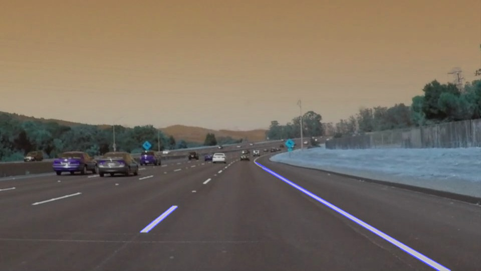

# **Finding Lane Lines on the Road** 
---
**Finding Lane Lines on the Road**

The goals / steps of this project are the following:
* Make a pipeline that finds lane lines on the road
* Reflect on your work in a written report

[//]: # (Image References)

[image1]: ./test_images_output/improved_solidWhiteCurve.jpg "Solid Lane"
[image2]: ./test_images_output/solidWhiteCurve.jpg "Dash Lane"

---

### Reflection

### 1. Describe your pipeline. As part of the description, explain how you modified the draw_lines() function.

The proposed pipeline consists of 7 steps:
  1. The images are converted to grayscale.
  2. The images are blurred by applying gaussian smoothing.
  3. I use Canny edge detector to identify edges on the images based on the defined thresholds.
  4. A region of interest is defined as a trapezoid which is more or less centered at the position where the road lanes are expected to be. A mask is definied based on this ROI and we keep only the pixels inside the trapezoid. 
  5. I use the Hough transformation to identify lines inside the ROI. 
  6. The detected lines are then filtered, averaged and extrapolated to map out the full extent of the left and right lane boundaries. 
      - I filter the lines based on their slope in order to create two groups (left lane = negative slope; right lane = positive slope).
      - Both the slope and the intersection point 'b' of each line are calculated.
      - I average (I actually use the median to minimize the effect of outliers) the slope and the intersection points of the lines belonging to each of the two groups. 
      - Having these new 'averaged' slopes and intersections, I compute the points at the boundaries defined by the ROI.
      - Now I can just plot this two lines on top of the image.
  7. The detected lanes are stacked on top of the original image.

  

### 2. Identify potential shortcomings with your current pipeline

One potential shortcoming would be what would happen when ... 

Another shortcoming could be ...

### 3. Suggest possible improvements to your pipeline

A possible improvement would be to ...

Another potential improvement could be to ...
