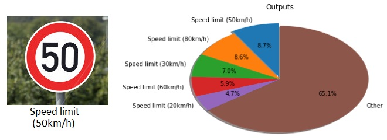
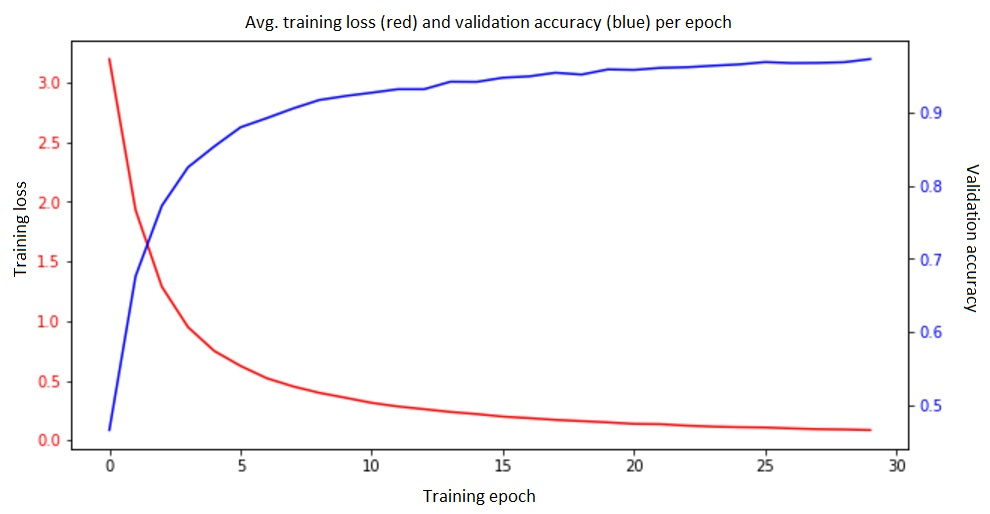
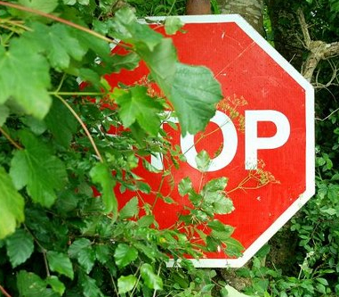
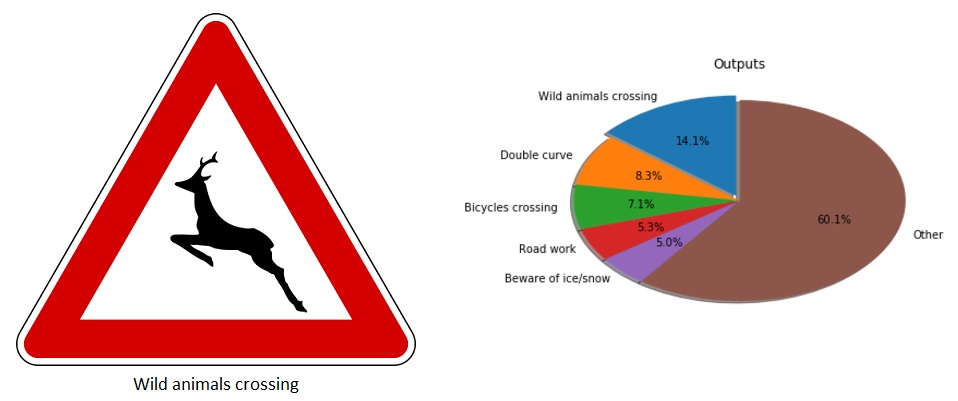
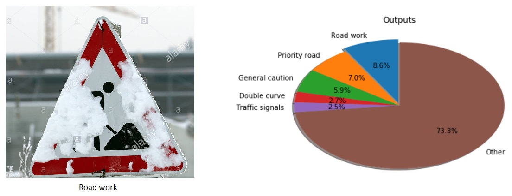
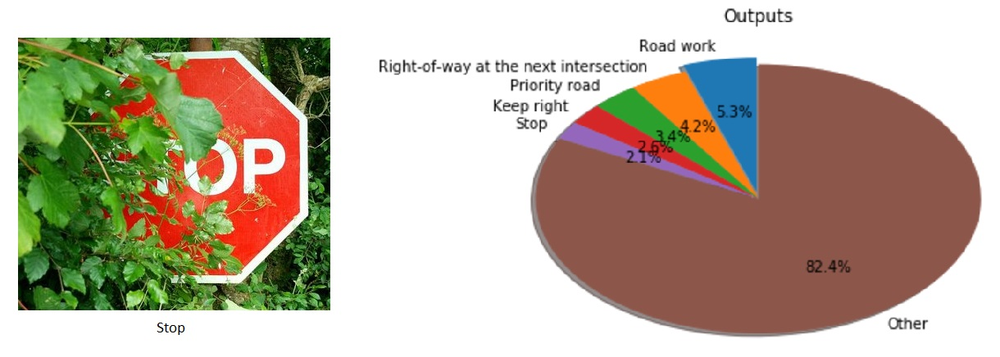

## Build a Traffic Sign Recognition Program

<table>
  <tr>
    <td align="center"></td>
  </tr>
  <tr>
    <td align="center"></td>
  </tr>
</table>

[//]: # (Image References)

[image1]: ./assets/train_samples.jpg "Training samples"
[image2]: ./assets/samples_per_categorie.jpg "Number of examples per categorie"
[image3]: ./assets/test_samples.jpg "Testing examples"
[image4]: ./assets/activations.jpg "Activations in first convolutional block"

## Overview

Second project in the UDACITYs Self-Driving Car Nanodegree.

Applying deep convolutional networks to classify traffic signs. Training and validation are performed using the [German Traffic Sign Dataset](http://benchmark.ini.rub.de/?section=gtsrb&subsection=dataset).

The project code can be found in this [link](Traffic_Sign_Classifier.ipynb). The TensorFlow model can be downloaded from [here](/model2).

### Summarizing the dataset

This is a short summary describing the [German Traffic Sign Dataset](http://benchmark.ini.rub.de/?section=gtsrb&subsection=dataset). The code for extracting this information from the dataset is located in the second code cell of the Ipython [notebook](https://github.com/camigord/Self-Driving-Car-Nanodegree/blob/master/P2-Traffic-Sign-Recognition/Traffic_Sign_Classifier.ipynb).

* The size of training set is 34799
* The size of the validation set is 4410
* The size of test set is 12630
* The shape of a traffic sign image is (32x32x3)
* The number of unique classes/labels in the data set is 43

### Visualizing and exploring the dataset.

Lets start by visualizing some of the training samples and their corresponding labels:

![alt text][image1]

We can also analyse how are the different labels distributed across the training, validation and testing datasets. The following image shows how many examples of each one of the 43 different categories are present on each dataset. It is possible to see that although these distributions are not uniform, the proportion of samples on each dataset is very similar.

![alt text][image2]


### Data preprocessing.

In my first try, I decided to only normalize the data without any further preprocessing. My idea was that the color channels may provide additional information to the particular task of classifying traffic road signs. This step was performed directly on TensorFlow employing the function _tf.image.per_image_standardization()_ on every image in the current batch as shown below:

```
  x = tf.placeholder(tf.float32, (None, 32, 32, 3))
  x_norm = tf.map_fn(lambda img: tf.image.per_image_standardization(img), x)
```

The problem with this approach was that it did not generalize very well to the test images taken from the internet, getting a very low accuracy (~20%). I believe that because of the color information, the network may overfit too easily to the training data. Effects like illumination and the general background of the image may have a strong effect in the classification accuracy.

In my second try and after tuning the model, I also tried to convert the images to grayscale. Again, the preprocessing was applied using TensorFlow and the function _tf.image.rgb_to_grayscale()_ which is capable of operating directly on image batches.

```
x = tf.placeholder(tf.float32, (None, 32, 32, 3))
# To Grayscale
x_gray = tf.image.rgb_to_grayscale(x)
# Normalization
x_norm = tf.map_fn(lambda img: tf.image.per_image_standardization(img), x_gray)
```

### Model Architecture

The final model is based on the [VGG architecture](https://arxiv.org/pdf/1409.1556.pdf). It consists of 4 convolutional layers arranged as shown below. For simplicity, I have removed the activation function from the table, but all the layers (convolutions and fully connected layers) are followed by a _ReLU_ activation.

<table>
  <tr>
    <td align="center"><b>Layer</b></td>
    <td align="center"><b>Description</b></td>
  </tr>
  <tr>
    <td align="center">Input</td>
    <td align="center">32x32x1 Grayscale image</td>
  </tr>
  <tr>
    <td align="center">Convolution 3x3</td>
    <td align="center">1x1 stride, valid padding, outputs 30x30x16</td>
  </tr>
  <tr>
    <td align="center">Convolution 3x3</td>
    <td align="center">1x1 stride, valid padding, outputs 28x28x16</td>
  </tr>
  <tr>
    <td align="center">Max pooling</td>
    <td align="center">2x2 stride,  valid padding, outputs 14x14x16</td>
  </tr>
  <tr>
    <td align="center">Convolution 3x3</td>
    <td align="center">1x1 stride, valid padding, outputs 12x12x24</td>
  </tr>
  <tr>
    <td align="center">Convolution 3x3</td>
    <td align="center">1x1 stride, valid padding, outputs 10x10x24</td>
  </tr>
  <tr>
    <td align="center">Max pooling</td>
    <td align="center">2x2 stride,  valid padding, outputs 5x5x24</td>
  </tr>
  <tr>
    <td align="center">Fully connected</td>
    <td align="center">size = 400</td>
  </tr>
  <tr>
    <td align="center" colspan="2">Dropout</td>
  </tr>
  <tr>
    <td align="center">Fully connected</td>
    <td align="center">size = 120</td>
  </tr>
  <tr>
    <td align="center" colspan="2">Dropout</td>
  </tr>
  <tr>
    <td align="center">Fully connected</td>
    <td align="center">size = 43</td>
  </tr>
  <tr>
    <td align="center" colspan="2">Softmax</td>
  </tr>
</table>

### Training the model

The model was trained using the following parameteres:

| Parameter			    |     Value	        		|
|:-----------------:|:---------------------:|
| Optimizer      		| Adam   								|
| Learning rate     | 0.0001   							|
| Batch size      	| 128   							  |	 
| Epochs      	    | 30   									|
| Dropout      	    | 0.8   								|

The figure below shows the learning curve of the model. The number of epochs was tuned so that training stops when the performance of the model does not improve significantly any further. The learning rate was initially set to 0.01, but it was tuned by observing the learning curve. The batch size was set to 128 because it is large enough to provide an informative gradient while still matching the computational power I had at hand. Dropout was set to 0.5, but the model was not learning fast enough; increasing the value to 0.8 improved the training time and validation accuracy.



#### Tuning the model

My final model results were:

| Dataset			      |     Accuracy	        |
|:-----------------:|:---------------------:|
| Training set      | 99.7%  								|
| Validation set    | 97.2%   							|
| Testing set      	| 94.5%  							  |	 

As mentioned above, I implemented the model based on the [VGG architecture](https://arxiv.org/pdf/1409.1556.pdf), which was a state of the art classification model a couple of years ago. The main idea behind this architecture is that we can replace a large receptive field convolutional layer with a stack of very small convolutional filters. The authors of the original paper demonstrated that this not only reduces the number of parameters in the model, but also improves the performance by making the classification model more discriminative.

 - Initially I trained the model without dropout, which resulted in the model quickly overfitting to the training set when using a learning rate of 0.01.
 - In my second attempt I introduced dropout with a probability of 50% after every fully connected layer and reduced the learning rate to 0.0001. This model, however, did not learn as fast as expected and was converging towards a training accuracy of around 60% after 40 epochs.
 - In my third attempt, and based on the previous results, I modified the dropout layers by keeping 80% of the activations while still using a small learning rate (0.0001). My logic was that the model may had not been complex enough to generalize to the data when using only 50% of the activations. This last model converged to the accuracies presented above in less than 30 epochs.

The reason why I decided to use the VGG architecture is because it is very similar to LeNet and very easy to implement on TensorFlow. Moreover, I was confident that this architecture should easily outperform LeNet provided proper tuning. If LeNet can achieve a classification accuracy of around 89% on this dataset, I was sure that a version of the VGG architecture improved by recent techniques like Dropout should improve these values and easily reach an accuracy of 93%.

### Testing the model on new images

I collected 10 different traffic signs from the web. The images and their respective label are shown below:

![alt text][image3]

Some of the images are very challenging and may be harder to classify given that they are partially occluded by snow or leaves. The _stop_ shield for example is covered my leaves from a near tree, while one of the _road work_ signs is occluded by snow.

#### Performance on this 'new' testing set

The final model was capable of correctly classifying all the images except from the following two:

<table>
  <tr>
    <td align="center"><b>Image</b></td>
    <td align="center"><b>Real label</b></td>
    <td align="center"><b>Prediction</b></td>
  </tr>
  <tr>
    <td align="center"></td>
    <td align="center">Stop</td>
    <td align="center">Road work</td>
  </tr>
  <tr>
    <td align="center"></td>
    <td align="center">Road work</td>
    <td align="center">Bycicles crossing</td>
  </tr>
</table>

It is clear that the _stop_ shield represents a big challenge given that most of the sign is occluded and it is therefore not surprising that the model is not capable of correctly classifying this sample. In order to improve the performance of the model, we could augment the training data with partially occluded examples.

The second mistake was made when classifying the _road work_ sign. The problem with this sample, in my opinion, is the fact that this particular categorie is not seen very often during training. There are only around 250 examples of this kind of signs in the training set, and this may be the reason why the classification accuracy of this type of samples is lower.

Nevertheless, the model was able to correctly classify 8 out of 10 traffic signs, which gives an accuracy of 80%. This may seem like a low accuracy compared to the 94.5% on the testing set, but we need to consider that we did not train the model with partially occluded samples. It is actually surprising that the model is capable of correctly classify one of the occluded examples (_road work_) given that half of the sign is covered by snow. If we ignore the missclassification of the _stop_ shield where the sign is mostly hidden from view, the model would achieve an accuracy of 90%.

#### Analyzing the output of the model:

We can also analyze how certain the model is when making a prediction. Below, we present 5 of the testing images together with the probability of the top 5 categories as given by the model. The code for generating theses figures and the results for the missing examples can be found Ipython [notebook](https://github.com/camigord/Self-Driving-Car-Nanodegree/blob/master/P2-Traffic-Sign-Recognition/Traffic_Sign_Classifier.ipynb).







For the first image, the model is relatively sure that this is a _Wild animal crossing_ sign (probability of 14.1%). For the second and third images, and although these examples are covered by snow, the model is also capable of correctly classifying the signs. For the second image, the models seems quite confident about the prediction (probability 11.9%), while for the third image, the model seems a bit confused between classifying the sign correctly as a _Road work_ or as a _Priority road_ (8.6% vs 7.0% respectively). For the fourth image, the model is quite sure that this is a _Speed limit_ sign, but it is not very confident about what is the exact speed limit. Fortunately, it seems to classify the image correctly by a very low margin. The final image shoes one of our occluded examples: the _Stop_ shield. In this case, the model missclasifies the image but it also seems to be quite uncertain about what is the correct label with no probability going higher than 6.0%.
