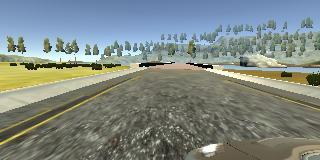
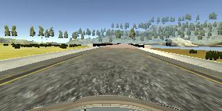
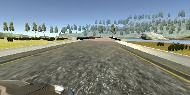

# Behavioral Cloning Project

[//]: # (Image References)

[image1]: ./examples/placeholder.png "Model Visualization"
[image2]: ./examples/placeholder_small.png "Recovery Image"

## Overview

This is my implementation code for the third project in the UDACITY Self-Driving Car Nanodegree . The purpose of the project is to teach a convolutional neural network how to replicate (or to _clone_) the behavior of a human driver.

Training data was collected using the simulation environment provided by UDACITY. The simulator can be downloaded from [here](https://github.com/udacity/self-driving-car-sim).

## Files

The current repository includes the following files:

* [model.py](model.py) containing the script to create and train the model
* [drive.py](drive.py) for driving the car in autonomous mode
* model.h5 containing the trained model
* [data_preprocessing.ipynb](data_preprocessing.ipynb) to visualize the preprocessing steps
* Two videos: run1.mp4 and run2.mp4, showing the performance of the final model on both tracks

## How to train and run the model

The model can be trained from scratch executing the following line:

```
python model.py --epochs 50 --batch_size 128
```

The previous script will save the final model as __model.h5__ which can be used to visualize the performance of the network directly on the simulator. For this, we need to execute the next line and start the simulator in _Autonomous mode_:

```
python drive.py model.h5
```

## Approach

### 1. Data collection

Although UDACITY provides an initial dataset which can be used as a starting point to train the model, it is important to collect additional data showing recovering maneuvers in order for the model to not only learn how to properly drive in the middle of the road, but also what to do in case it encounters a challenging scenario or in case it drives off the road. It is also very helpful to collect data from the second and more challenging track to encourage the model to generalize and to avoid overfitting to the first track. For this reason, I collected data from both tracks driving in both directions and showing the model how to recover and come back to the middle of the road. This dataset, however, is not provided here.

### 2. Data preprocessing

**Note:** All the preprocessing steps are also explained and can be better visualized in [this](data_preprocessing.ipynb) jupyter notebook.

When running the simulator in _Training Mode_ it collects 3 images per frame corresponding to left-, right-, and center-mounted cameras. It also creates a _csv_ file containing the path to each image together with the steering angle and speed for each frame (among other values).

#### 2.1 Setting a minimum speed
The first preprocessing step was to ignore any training sample where the velocity of the car was below a given threshold. The logic behind this decision is that the speed of the car has a strong influence on the steering angle (you clearly have more time to turn if you are driving slowly...) and using samples where the car is practically not moving wouldn't help. To set this threshold, I plotted the distribution of speeds in the training samples and I chose a value which makes sense given the speed with which we are going to test the model: _Minimum speed = 10.0_.

#### 2.2 Adjusting left- and right-mounted cameras
The steering angle collected when training is relative to the center-mounted camera. If we want to augment the data by using the other two camera views we need to properly adjust the steering angles which are assigned to these training images. When loading the 3 different images we adjust the steering angle of the left- and the right-mounted camera images by a factor of +0.25 and -0.25 respectively.

<table>
  <tr>
    <td></td>
    <td></td>
    <td></td>
  </tr>
  <tr>
    <td align="center">Angle = 0.33</td>
    <td align="center">Angle = 0.08</td>
    <td align="center">Angle = -0.16</td>
  </tr>
</table>

#### 2.3 Flattening the data distribution
Given the structure of the training tracks where long segments of the road contained no curves, it is very easy to collect a lot of data where the steering angle is very low if not 0. The problem with this data is that it biases the training of the network towards predicting very small steering angles all the time, and thus performing very poorly when facing sharp turns. The original distribution of the steering angles can be seen below.

![alt text][image2]


#### 2.3 Add random distortions
