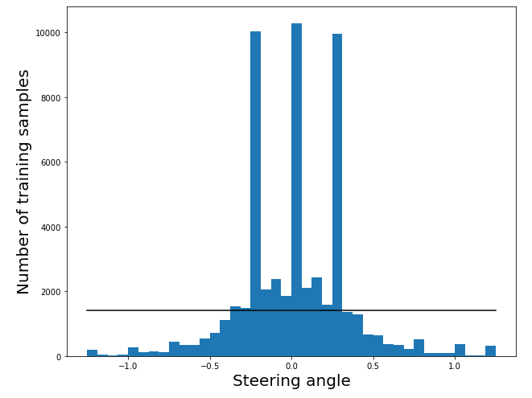
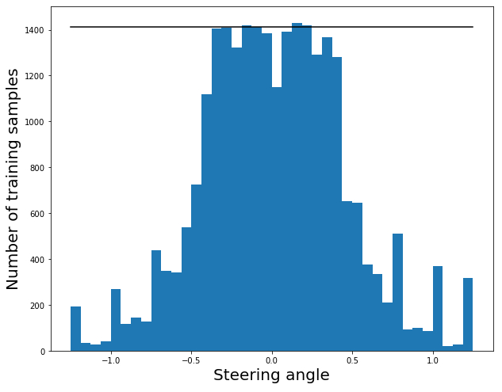
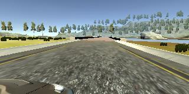
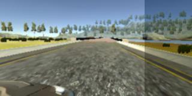
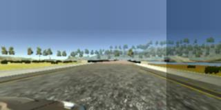
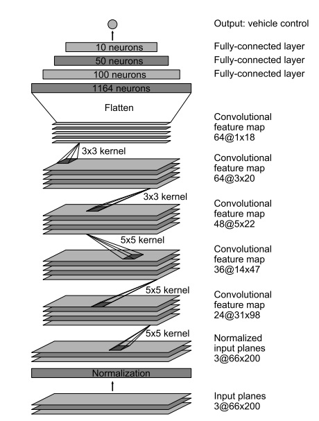
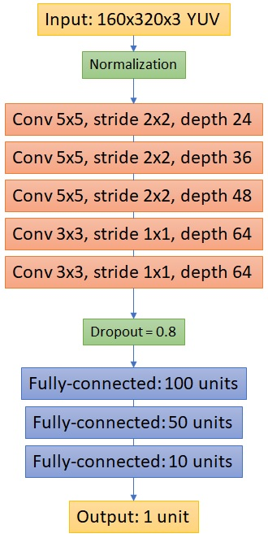
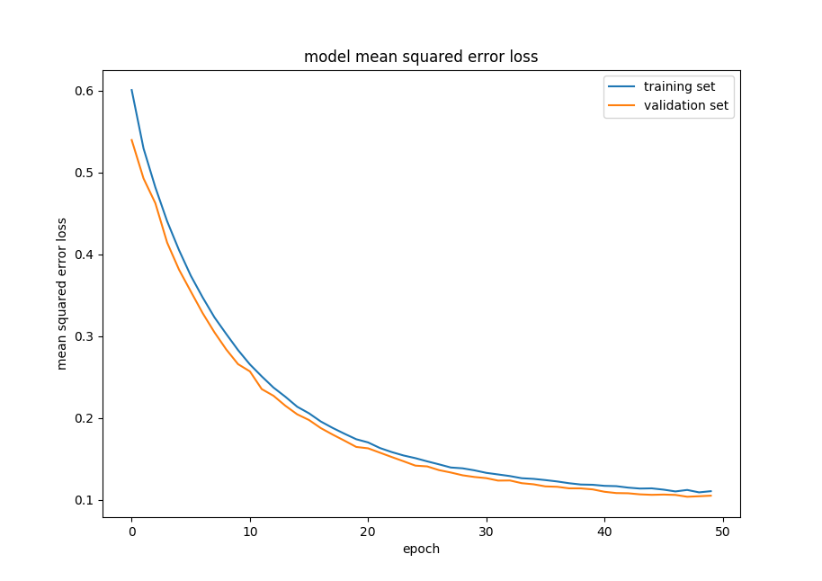

# Behavioral Cloning Project

<table>
  <tr>
    <td></td>
    <td></td>
  </tr>
  <tr>
    <td align="center">Track 1</td>
    <td align="center">Track 2</td>
  </tr>
</table>


## Overview

This is my implementation code for the third project in the UDACITY Self-Driving Car Nanodegree . The purpose of the project is to teach a convolutional neural network how to replicate (or to _clone_) the behavior of a human driver.

Training data was collected using the simulation environment provided by UDACITY. The simulator can be downloaded from [here](https://github.com/udacity/self-driving-car-sim).

## Files

The current repository includes the following files:

* [model.py](model.py) containing the script to create and train the model.
* [drive.py](drive.py) for driving the car in autonomous mode
* model.h5 containing the trained model.
* [utils.py](./utils/utils,py) containing the training data generator and the preprocessing functions.
* [data_preprocessing.ipynb](data_preprocessing.ipynb) to visualize the preprocessing steps.
* Two videos: track1.mp4 and track2.mp4, showing the performance of the final model on both tracks.

## How to train and run the model

The model can be trained from scratch executing the following line:

```
python model.py --epochs 50 --batch_size 128
```

The previous script will save the final model as __model.h5__ which can be used to visualize the performance of the network directly on the simulator. For this, we need to execute the next line and start the simulator in _Autonomous mode_:

```
python drive.py model.h5
```

## Approach

### 1. Data collection

Although UDACITY provides an initial dataset which can be used as a starting point to train the model, it is important to collect additional data showing recovering maneuvers in order for the model to not only learn how to properly drive in the middle of the road, but also what to do in case it encounters a challenging scenario or in case it drives off the road. It is also very helpful to collect data from the second and more challenging track to encourage the model to generalize and to avoid overfitting to the first track. For this reason, I collected data from both tracks driving in both directions and showing the model how to recover and come back to the middle of the road. This dataset, however, is not provided here.

### 2. Data preprocessing

**Note:** All the preprocessing steps are also explained and can be better visualized in [this](data_preprocessing.ipynb) jupyter notebook.

When running the simulator in _Training Mode_ it collects 3 images per frame corresponding to left-, right-, and center-mounted cameras. It also creates a _csv_ file containing the path to each image together with the steering angle and speed for each frame (among other values).

#### 2.1 Setting a minimum speed
The first preprocessing step was to ignore any training sample where the velocity of the car was below a given threshold. The logic behind this decision is that the speed of the car has a strong influence on the steering angle (you clearly have more time to turn if you are driving slowly...) and using samples where the car is practically not moving wouldn't help. To set this threshold, I plotted the distribution of speeds in the training samples and I chose a value which makes sense given the speed with which we are going to test the model: _Minimum speed = 10.0_.

#### 2.2 Adjusting left- and right-mounted cameras
The steering angle collected when training is relative to the center-mounted camera. If we want to augment the data by using the other two camera views we need to properly adjust the steering angles which are assigned to these training images. When loading the 3 different images we adjust the steering angle of the left- and the right-mounted camera images by a factor of +0.25 and -0.25 respectively.

The images below show an example of the 3 camera views. As described in section 2.6, we will later crop the top and bottom of the images in order to remove the sky and the portion of the car which remains visible at the bottom, thus making it easier for the network to generalize.

<table>
  <tr>
    <td></td>
    <td></td>
    <td></td>
  </tr>
  <tr>
    <td align="center">Angle = 0.33</td>
    <td align="center">Angle = 0.08</td>
    <td align="center">Angle = -0.16</td>
  </tr>
</table>

#### 2.3 Flattening the data distribution
Given the structure of the training tracks where long segments of the road contained no curves, it is very easy to collect a lot of data where the steering angle is very low if not 0. The problem with this data is that it biases the training of the network towards predicting very small steering angles all the time, and thus performing very poorly when facing sharp turns. The original distribution of the steering angles can be seen below.



It is clear that driving straight is over-represented (the left and right peaks arise from using the left- and right-mounted cameras) and that it is necessary to somehow delete some of these training samples in order to flat the distribution and achieve a more balanced training set. The black line in the image represents the average of examples over the different bins in the histogram.

To flatten the distribution I decided to follow the advice posted at the UDACITY's forums and to remove samples in a probabilistic manner. I compute a _keep_probability_ for each of the bins in the histogram based on how far the number of samples in that bin is from the total average. If the current bin contains less samples than the average, _keep_probability_ is set 1.0; otherwise the probability decreases proportionally to how far is the number of samples from the current average. After following this approach and removing or keeping each sample according to its respective probability, the resulting data distribution looks like this:



Although it is still not perfect, it is already a lot better than the original distribution. We could keep improving the training dataset by carefully recording more data, but this distribution worked fine for me. Moreover, we can still selectively augment some of the dataset as described in section 2.5.

#### 2.4 Add random distortions

The techniques presented in this section are inspired on the work from [Jeremy Shannon](https://github.com/jeremy-shannon/CarND-Behavioral-Cloning-Project). I used some of his code for preprocessing the images (shadowing and perspective change) and I combined it with some of my own ideas. 

In order to augment the data and improve the capability of the network to generalize to different conditions, several random distortions are applied on the training images when generating the training batches. _These distortions are not applied when validating or testing the network_.

We start by filtering the image using Gaussian Blur and converting the image into YUV space. We then randomly adjust the brightness of the image, introduce a random shadow and a random change in perspective. The shadow effect is achieved by randomly darkening a rectangular section of the image. The perspective transformation allows the model to be more robust to the situations observed in the second and more challenging task. An example of each of the steps is presented below.

<table>
  <tr>
    <td align="center">Original</td>
    <td></td>
  </tr>
  <tr>
    <td align="center">Blurred image</td>
    <td></td>
  </tr>
  <tr>
    <td align="center">Random brightness</td>
    <td></td>
  </tr>
  <tr>
    <td align="center">Add shadow</td>
    <td></td>
  </tr>
  <tr>
    <td align="center">Change perspective</td>
    <td></td>
  </tr>
</table>

#### 2.5 Augmenting data by flipping images

The training data generator loads the images, preprocesses them and applies the previously described distortions. Moreover, it augments the data by randomly flipping the images and properly adjusting the steering angles (multiplying by -1). However, we do not want to augment all the data! The generator applies this random flipping only to those images which absolute steering angle is larger than 0.3. This allows us to further compensate for the fact that our training distribution is still not perfectly balanced.

#### 2.6 Normalizing and cropping
Finally, the training images are normalized directly at the input of the model using Keras Lambda function. Additionally, we crop the input images in order to remove the top (sky) and the bottom (car) of the images:
```
model.add(Lambda(lambda x: x/127.5 - 1., input_shape=(160,320,3)))
model.add(Cropping2D(cropping=((50,25), (0,0))))
```
### Model Architecture and Training Strategy

The first model I tried is shown below and was based on the architecture proposed by [Nvidia](https://images.nvidia.com/content/tegra/automotive/images/2016/solutions/pdf/end-to-end-dl-using-px.pdf) for self-driving vars.



Initially I had some problems training the model and avoiding overfitting. During my first experiments, none of the preprocessing steps presented before had been applied and I was only using the training dataset provided by UDACITY. For this reason, it happened that the model was not capable of generalizing and was performing rather poorly in both tracks (specially when facing sharp curves).

These initial results proved to me the importance of having a well balanced dataset and encouraged me to work on the different augmentation and preprocessing techniques mentioned in previous sections. Once I was done preparing the new training data, I performed some slight modifications on the previous model and I ended up with the following architecture:

<table border="0">
  <tr>
    <td width="40%" align="left">- All the convolutional and fully-connected layers are followed by an ELU activation function.</td>
    <td rowspan="2" align="center"></td>
  </tr>
  <tr>
    <td align="left">L2 regularization is applied on all the layers (lambda = 0.001)</td>
  </tr>
</table>

In general, the model is quite similar to the Nvidia model and introduces only a few modifications:

* A Dropout layer after the convolutional layers. The keep probability was set to 80% after training and comparing with different values.

* ELU activations instead of ReLUs.

* L2 regularization to avoid overfitting.

The model was trained using an ADAM optimizer with a learning rate of 0.0001. This learning rate was tuned by observing the training curves of the model after 50 epochs. The batch size was set to 128 during all the experiments.

### Drive.py

In order to test the model in Autonomous mode, the file [_drive.py_](drive.py) had to be modified in order to apply the same preprocessing to the input images. The function _preprocess_image()_ takes care of applying a Gaussian blur to the image and transforms it into YUV space.

I also modified the testing speed for the first track and increased it from 9.0 to 20.0. The model performs well with both speeds but it is faster to evaluate the performance when driving fast! The second track, however, does not allow us to modify the speed given the large amount of sharp curves.

### Results

The figure below shows the training and validation errors of the final model when trained during 50 epochs. The training was stopped there because it is clear that the model has already converged and further training may result in overfitting. It can also be seen that with the proposed learning rate both the validation and training errors decreased smoothly.



The behaviour of the model when driving on both tracks can be seen in the animations at the beginning of this file. It is also possible to download the videos [track1.mp4](track1.mp4) and [track2.mp4](track2.mp4) where a first person view of the driving was recorded. These videos, however, have a lower resolutions that the animations provided above.

The results show a nice and very smooth driving behavior on both tracks. On the first track, the model is even capable of driving much faster than what was originally proposed without having any troubles. The second track is much more challenging but the model is capable of driving the entire track without going out of the road.

### Conclusions

Most of my time during this project was spent collecting, analyzing and preprocessing the training data. The model architecture ended up not being very relevant or even challenging and that showed me how important having proper data can be. It doesn't matter if you have a state of the art architecture if you do not invest a proper amount of time preparing your data.

I had, however, a lot of fun implementing this project and I can imagine different ways how the current model could be further improved. It would be very interesting, for example, to train the model to also predict other parameters like speed. If the network is capable of learning to steer the vehicle, it surely can also learn how fast it is supposed to be driving in a given section of the road.
