# Advanced Lane Finding

<table>
  <tr>
    <td></td>
  </tr>
</table>

## Overview

Fourth project in the UDACITY Self-Driving Car NanoDegree: Identifying lane boundaries in a video from a front-facing camera on a car.

## Files

The current repository includes the following files:

* [Generate_video.ipynb](Generate_video.ipynb) containing the final pipeline and capable of loading and processing frames from the given videos.
* [Binary_Images.ipynb](Binary_Images.ipynb) describing how the binary images are generated and showing some filter examples.
* [Processing_Steps.ipynb](Processing_Steps.ipynb) Describing each step in the pipeline.
* [utils.py](./utils/utils.py) containing all the described functions.
* [Line.py](./utils/Line.py) containing the Line Class used to keep track of each lane (left & right lanes).
* A folder [output_videos](./output_videos) containing the 3 generated video sequences.

The generated videos are stored in the folder [output_videos](./output_videos).

## Approach

### 1. Camera calibration

I started the project by computing the camera calibration matrix and distortion coefficients using the images in [this](./camera_cal) folder. The entire code can be found [here](Processing_Steps.ipynb).

I used the OpenCV function _cv2.findChessboardCorners()_ to detect all the inner corners on each calibration image. Using these points together with a set of fixed _object points_ I am able to compute the camera calibration and distortion coefficients using the _cv2.calibrateCamera()_ function. Finally, I save the results as a pickle [file](./camera_cal/coefficients.p) in order to be able to load the coefficients any time when required.

The images below show the result of correcting the distortion on an image using the function _cv2.undistort()_.

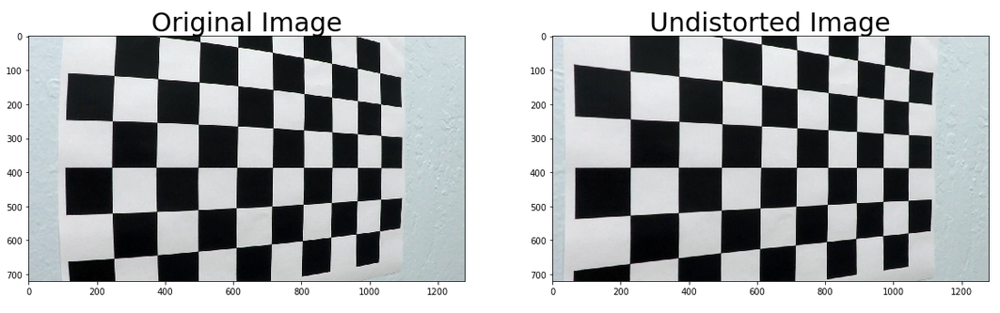


### 2. Creating a thresholded binary image

The next step is to define a set of filters capable of thresholding the images in such a way that detecting the road lanes becomes easier.

The main idea is to find a color space in which the road lanes are clearly visible and in which the illumination conditions do not have a strong effect in the final outcome. As described in [this](Binary_Images.ipynb) notebook, I evaluated several color spaces (i.e HLS, YUV, HSV) while trying to find a combination of filters and parameters that perform well and provide robust results in different test scenarios. This was one of the most time consuming steps in this project and it was also a bit frustrating because a set of parameters which work perfectly fine for a set of images may produce a terrible result when tested on a different video sequence.

__Note__: Although I was able to find a set of filters which work perfectly fine for the _project video_, this pipeline worked very poorly on the other and more challenging videos. For this reason, I decided to use a more simple set of filters which happen to perform very well on the first video and very decently on the other two.

The final pipeline can be found in [utils.py](./utils/utils.py) with the name _get_binary_image(...)_ (lines 50 to 92). The function takes an image as an input and applies 3 different binary thresholds in two different color spaces (i.e HLS and YUV) in order to detect both yellow lanes and white lanes. The three resulting binary images are then combined in order to produce a final thresholded image. The table below shows the results after applying the corresponding filters for detecting the yellow and white lanes.

<table>
  <tr>
    <td align="center">Original</td>
    <td align="center">Yellow Lane</td>
    <td align="center">White Lane</td>
    <td align="center">Final Result</td>
  </tr>
  <tr>
    <td>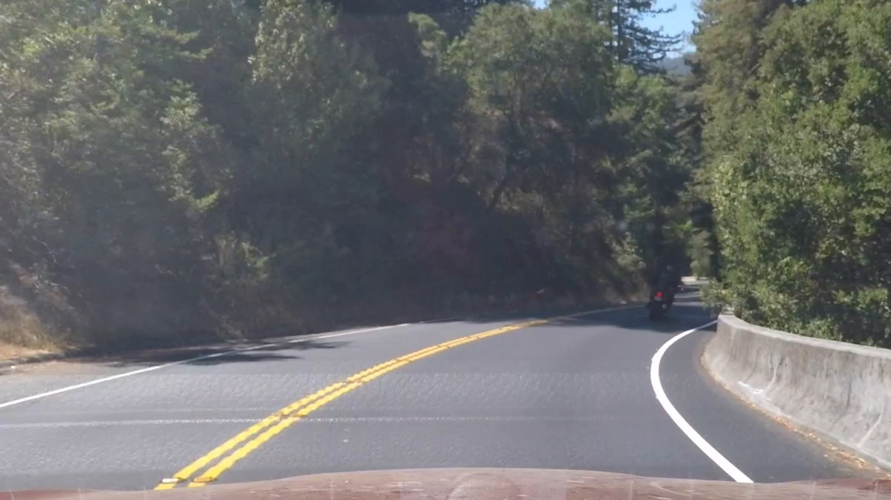</td>
    <td>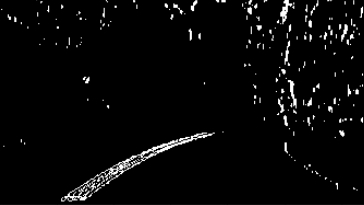</td>
    <td>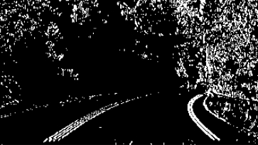</td>
    <td>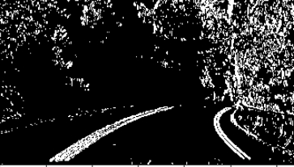</td>
  </tr>
</table>

The images below show additional examples taken from the _challenge_video_ and the _harder_challenge_video_ respectively.

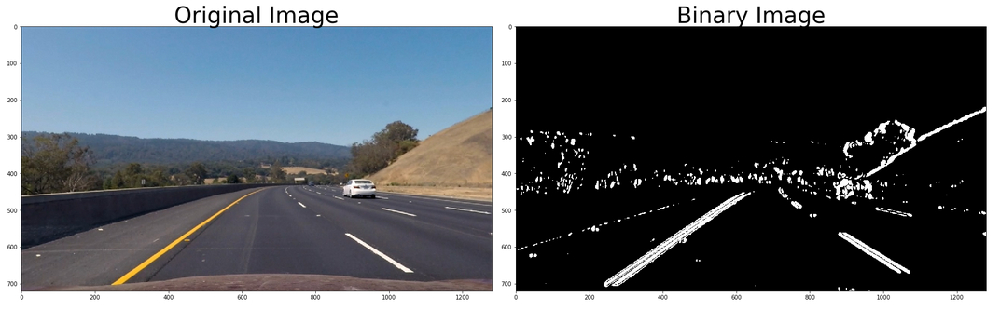

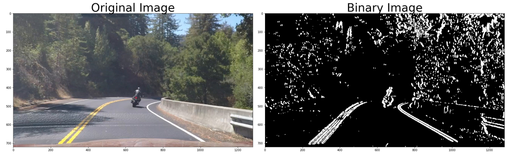

### 3. Perspective transformation

In order to make it easier for us to estimate the curvature of the road we are going to perform a perspective transformation to obtain an eagle-eye view of the scene. The function in charge of performing this transformation is called _get_eagle_eye(...)_ and appears in lines 18 through 28 of the file [utils.py](./utils/utils.py). The function takes as input an image and applies a perspective transformation using the function _cv2.getPerspectiveTransform()_ and a set of hardcoded _source_ and _destination_ points which are defined as:

```
src_points = np.float32([[200,720],[453,547],[835,547],[1100,720]])
dst_points = np.float32([[320,720],[320,576],[960,576],[960,720]])
```

The outcome of the function together with a representation of the source and destination points respectively can be seen in the images below.

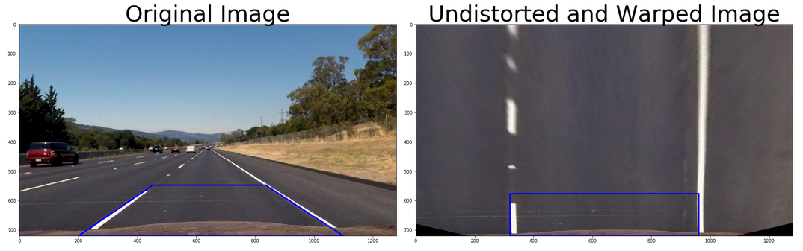

The example above corresponds to a straight line and we can see that the result represents two straight and parallel lines. We can call this function with a different example and obtain the representation of a curve:

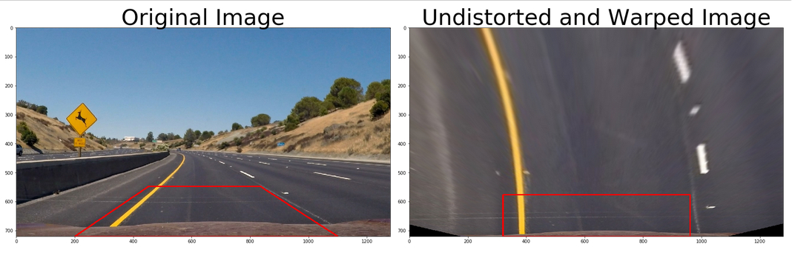


### 4. Detecting lane pixels and fitting a polynomial


#### Peaks in a Histogram

The first step to identify the lane pixels is to recognize the origin of the lanes at the bottom of each image. After thresholding and applying the perspective transformation we end up with an image in which the lanes stand out clearly (_at least in most of the cases_). We can now compute a histogram along the columns in the lower part of the image like this:

```
histogram = np.sum(image[int(image.shape[0]*4/5):,:], axis=0)
```

I am only considering the lowest fifth part of the image when computing the histogram. The result looks something like this:

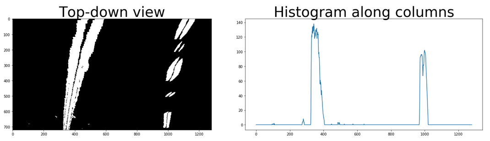

Once we have the histogram we can find the peaks at the left and right sides of the image. I decided to introduce a _margin  value_ in order to constraint the search regions both at the left and the right sides. The final function is called _find_lanes_hist(top_down)_ and appears in lines 106 through 119 of the file [utils.py](./utils/utils.py). The function takes the thresholded and warped top-down view image and return the origin of the left and the right lanes.

As it will be explained in section 7, it will not always be necessary to identify the origin of the lanes. If the detection on the previous frame was successful and a reliable fit was estimated, we can use this previous fit to estimate the location and orientation of both lanes in the current frame (we can easily assume that the curvature of the lanes is not going to change too drastically from one frame to the other). To perform this process, I wrote the function _get_poly_from_last()_ which appears in lines 122-149 of the [utils.py](./utils/utils.py) file. The function takes the current top-down binary image together with the previous fit polynomials and performs a local search looking for active pixels around these fits.

#### Sliding Window

When a reliable fit can not be estimated during the previous frame, we do not only need to call the _find_lanes_hist()_ function, but we also need to identify which pixels belong to each one of the road lanes. UDACITY propose a function which I have called _get_polynomial()_ and which appears in lines 151-216 of the [utils.py](./utils/utils.py) file. This function employs a sliding window approach which starts at the bottom of the image (at the location where the lanes centers were found) and slides a searching window upwards re-centering the window based on the mean of the detected points within that window. Once the search is complete, the function employs all the detected points at the left and the right of the image to fit a second order polynomial for the left and the right lane respectively.

The image below show and example of the outcome of this function where the green boxes represent the sliding windows and the red and blue points represent the detected left lane and right lane pixels respectively.

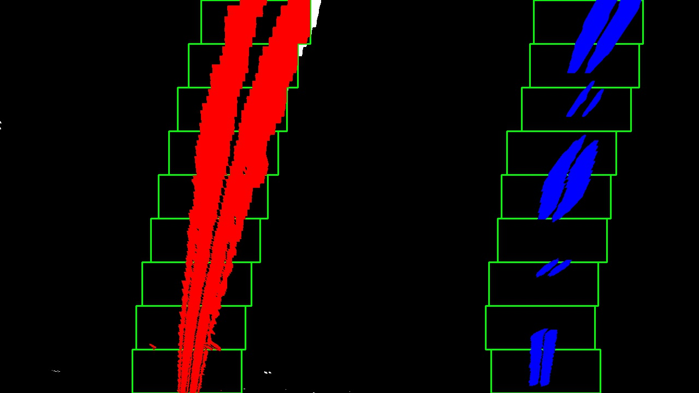

This function works quite well for both the _project_video_ and the _challenge_video_ but it is just not capable of dealing with more complex scenes like the ones found in the _harder_challenge_video_. This is because the function assumes that both lanes will cover the entire image as shown in the image above and the position of the windows have therefore been hard-coded in advance. When presented with a more challenging frame like the one presented below, the windows do not longer follow the direction of the lanes and we end up computing a completely wrong polynomial.

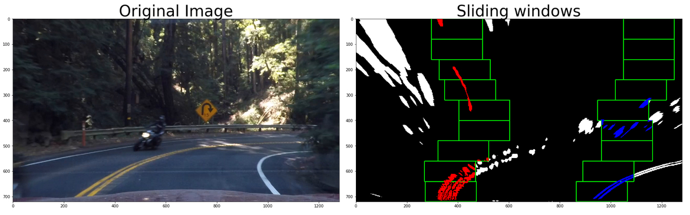

To alleviate this problem I made some slight modification to the original function and I created a new one called _get_polynomial2()_ (the amount of creativity invested in the name is outstanding!). This function can be found in the same [utils.py](./utils/utils.py) file, lines 219-388. The proposed function does not hard-code the position of the searching windows but adapt this position based on the points which have been found so far. The function fits a line to the detected points and estimates the center of the next window based on this fit so that the next window is located either on top of the current window or to its sides.

The figure below shows the result of calling the proposed function on the same frame presented before. It is possible to see that the function is capable of identifying and following the direction of the lanes correctly.

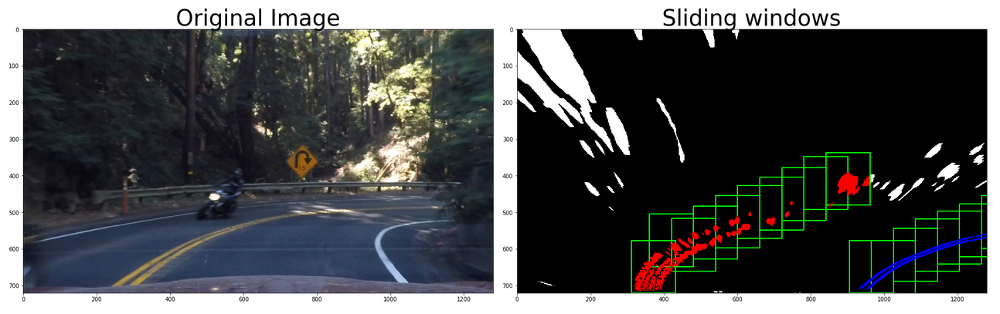

Although this function works quite well in most of the cases, giving the algorithm the flexibility to search in different directions can also be a problem specially in binary images with a lot of noise (images where the lanes are not easily identifiable or where other objects can be distracting). I ended up using this last function although it seems that the original version may work better in the first two videos.

### 5. Determine lane curvature and vehicle position

#### Radius of curvature

Now that we have a second order polynomial describing both left and right lanes we can estimate the _radius of curvature_ of each lane. The radius of curvature for any function _x=f(y)_ is given by:

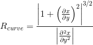

Because our polynomial has the form f(y) = Ay<sup>2</sup> + By + C, this formula becomes:


where A and B are the polynomial coefficients and _y_ represents the point along the curve where we want to estimate the radius of curvature.

Given that we want to estimate the radius of curvature in a metric unit, we need to convert the pixel space into real world space. To do this, we introduce two scaling factor: _ym_per_pix_ and _xm_per_pix_ which represent the length in meters that each pixel in the image represents. These values are defined based on a rough estimate which assumes that we are projecting a lane about 30 meters long and 3.7 meters wide:

```
ym_per_pix = 30/720 # meters per pixel in y dimension
xm_per_pix = 3.7/700 # meters per pixel in x dimension
```

The function _get_curvature(...)_ in charge of computing the radius of curvature is located in lines 323 through 337 of the file [utils.py](./utils/utils.py). It takes the x and y position of the pixels detected on each lane as input and returns the curvature of each lane.

#### Distance to center

If we assume that the camera is mounted at the center of the car we can also estimate our distance to the center of the lane. The function _find_position(...)_ in lines 355 through 363 of the file [utils.py](./utils/utils.py) takes the position of the left and right lanes at the bottom of the image and returns the distance from the car to the center of the lane. To do this, we compute the center of the lane using the two previously mentioned points and compare this center with the center of the image. The difference is finally transformed into metric space.

Both the curvature and the distance to center are then drawn on top of the original image using the function _cv2.putText()_ in order to provide some feedback about the road.

### 6. Warping the detected lanes boundaries back onto the original image

The final step in our processing pipeline consists in warping the detected lane boundaries back onto the original image. To do this, we start by drawing the segment of the road which has been detected in between both lanes using the function _cv2.fillPoly()_. Once this is done, we can change the perspective back into the original point of view by calling the function _get_inverse_transform()_ located in lines 30-37 of the file [utils.py](./utils/utils.py). The functions takes our top-down view image and computes an inverse transformation matrix using the _destination_ and _source_ points presented before.

The final result look something like this:


### 7. Loading and processing video frames

I created [this](Generate_video.ipynb) notebook to load the 3 different testing videos and to generate the final results using [moviepy](http://zulko.github.io/moviepy/). The notebook loads the camera calibration coefficients in the second cell and defines a _process_image(image)_ function in cell 4. _Moviepy_ will take care of calling this function frame by frame after loading the videos in cell 5. Once all the frames have been processed a video output is saved in the folder [output_videos](./output_videos).

Following the advice provided by UDACITY, I defined a class [_Line()_]((./utils/Line.py)) which will take care of storing some information about each individual lane (left or right) and will also keep track of all the interesting parameters which have been measured during previous frames in order to generate a more accurate and smooth result.

The _Line_ class is very simple: if a lane has been properly detected in the current frame (therefore it passes the _sanity_check_ described below), the class stores all the parameters (fit, curvature, position) into a queue. This queue will store a maximum of _K=5_ frames. Every time we need to access some information about the current lane, we do not get the most recent values, but an average over the last _K_ stored results.

I also tried a different approach where instead of storing a history of _K_ values I only kept a weighted average of each parameter. Every new value receives a weight of _0.2_ while the current estimate is weighted by _0.8_. Although there was no significant difference between both approaches when working on the first two videos, this last approach performed a bit better in the _harder_challenge_video_. I believe this is because the last and more challenging video presents a lot of quick and consecutive curves where having an average over a long history of observations may not work very well.

#### Processing each video frame

The function _process_image(image)_ in cell 4 of the notebook takes care of executing all the previously described operations. The final pipeline looks like this:

```
  1. Correct for distortions
  2. Apply binary filters
  3. Get top-down view by changing perspective
     if lane was detected in last frame:
         4.1. Fit polynomial using previous parameters as guideline
     else:
         4.1. Find center of lanes at the bottom of image
         4.2 Fit polynomial
  5. Get curvature and distance to center
     if sanity_check is valid:
         6.1. Add parameters to class
     else:
         6.2. Ignore current fit
  7. Get average parameters from Line class
  8. Draw lane boundaries and road segment and warp back onto original image
  9. Draw curvature and distance to center on image
```

The _sanity check_ is executed by the function _sanity_check()_ located in lines 406-420 of the file [utils.py](./utils/utils.py). I tried different conditions in order to verify if the detections made sense but I found out that most of these conditions did not generalize well to all the 3 testing videos. The _harder_challenge_video_, for example, presents very sharp curves where the same logic that I was applying for the _project_video_ did not apply. After trying and simplifying different conditions I ended up with 3 very basic rules:

  1. The curvature of any of the lanes can not be lower than a given threshold (10 meters). This rule is basically only helpful to ignore some fits produced when in presence of a lot of noise and when using the proposed _get_polynomial2()_ function.

  2. The distance in meters between both lanes at the bottom of the image needs to be within a given range: [2.3, 4.2] meters.

  3. The horizontal distance between both lanes can never be smaller than 1 meter.

## Discussion

Overall, this project was quite interesting and it provides many opportunities to be creative by tuning different parameters, defining new and more robust filters or by developing more accurate detection pipelines. This process of tuning the different parameters, however, can also be quite frustrating considering that a solution which works perfectly fine when tested on one video may perform very poorly on the other two...

I can think about a couple of ideas for further improving the current pipeline that I was not able to explore given the lack of time:

  1. The binary filters used to threshold the images can still be made much better. A possible approach I read about would be to define adaptive thresholds which would be a function of some parameters like the average illumination of the current frame. In the same way, the set of filters to be used could also be chosen adaptively, thus employing more proper color spaces according to the the type of image we are currently evaluating.

  2. The sanity check is a function were I did not invest too much time and where I recognize that additional improvements could be made. To be able to discard complicated frames would significantly improve the general performance.
