# Vehicle Detection and Tracking

<table>
  <tr>
    <td></td>
  </tr>
</table>

## Overview

My implementation code for the fifth and final project in the first term of the UDACITY Self-Driving Car NanoDegree: Detecting and tracking vehicles in video frames.

## Files

The current repository includes the following files:

* [Generate_video.ipynb](./Generate_video.ipynb) containing the final pipeline and capable of loading and processing frames from the given videos.
* [Split_data.ipynb](./Split_data.ipynb) describing the process used to split the training data into training and testing sets. .
* [Train_Classifier.ipynb](./Train_Classifier.ipynb) containing the feature analysis, visualization and reduction together with the training of the final classifier.
* [Detecting_Cars.ipynb](./Detecting_Cars.ipynb) describing the employed pipeline to detect and track vehicles in images using sliding windows.
* [utils.py](./utils/utils.py) containing all the described functions.
* A folder [output_videos](./output_videos) containing the generated video sequences.

## Approach

### 1. Training a classifier

The first step in the project consists on training a binary classifier capable of recognizing between cars and other type of images. For this step I used some data provided by UDACITY in the following links: [vehicle](https://s3.amazonaws.com/udacity-sdc/Vehicle_Tracking/vehicles.zip), [non-vehicle](https://s3.amazonaws.com/udacity-sdc/Vehicle_Tracking/non-vehicles.zip). These example images come from a combination of the [GTI vehicle image database](http://www.gti.ssr.upm.es/data/Vehicle_database.html) and the [KITTI vision benchmark suite](http://www.cvlibs.net/datasets/kitti/). The figure below shows some examples for both target (cars) and non-target examples.

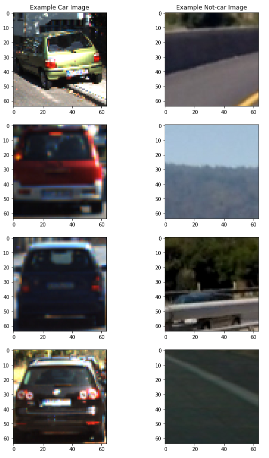

#### 1.1 Splitting data into training and testing sets

Because most of the provided images were extracted from video sequences, many of them present a high correlation between each other. To avoid having very similar examples both in our training and testing sets we can not just shuffle and split the data randomly. In [this](./Split_data.ipynb) notebook I took care of splitting the data taking care of its sequential nature. I reserved 20% of the available data for testing our classification model as shown in the table below.

<table>
  <tr>
    <td align="center"></td>
    <td align="center">Training</td>
    <td align="center">Testing</td>
  </tr>
  <tr>
    <td align="center">Vehicles</td>
    <td align="center">7037</td>
    <td align="center">1755</td>
  </tr>
  <tr>
    <td align="center">Non-vehicles</td>
    <td align="center">7174</td>
    <td align="center">1794</td>
  </tr>
  <tr>
    <td align="center">Total</td>
    <td align="center">14211</td>
    <td align="center">3549</td>
  </tr>
</table>

#### 1.2 Evaluating and analyzing features

The project description given by UDACITY recommends the use of 3 kind of features:

  - Color features
  - Spatial features
  - Histogram of Oriented Gradients (HOG) features

As it will be shown in the following sections, I did not get any improvement in the classification accuracy when using _spatial features_ which led me to remove them from my classification pipeline. In this section I will provide a short summary about the remaining two types of features together with some visualizations.

  + __HOG features:__ The _histogram of oriented gradients_ is computed by the function _get_hog_features()_ in lines 31 to 47 of [this](./utils.utils.py) file. The figure below shows a comparison between the HOG features of a car image and the features associated to a non-car image.

  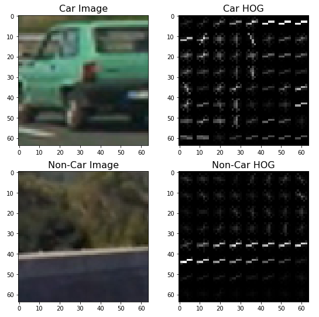

  + __Histograms of color:__ These features are computed by extracting a histogram over the pixel intensities on an image using the function _color_hist()_ in lines 56 to 63 of [this](./utils.utils.py) file. The figure below shows the _color histograms_ for the two examples presented before. It can be seen that there are some clear differences between the histograms for targets and non-target samples.

  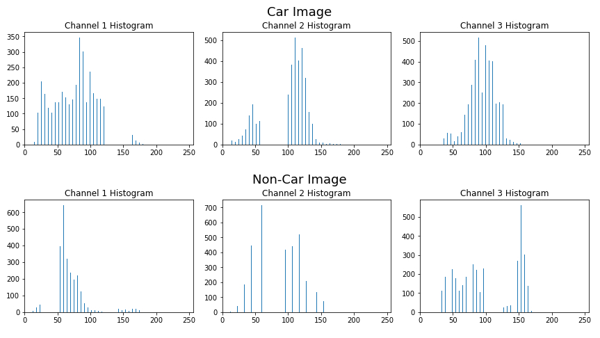

These two types of features are computed for each one of our training/testing samples and are concatenated in order to create a single array of features for each image. This process is executed in the cell _-Extract features for training and test-_ of the Train_Classifier [notebook](./Train_Classifier.ipynb).

#### 1.3 Normalizing features

Before training the classifier it is important to normalize all the employed features. Normalization is important in those cases where different features present different scales or units and it may therefore be possible for one or a couple of them to completely dominate all the others.

Normalization takes place in the cell _-Fit a per-column scaler-_ of the Train_Classifier [notebook](./Train_Classifier.ipynb). I employ the StandardScaler() method provided by _sklearn_ and I save it using _pickle_ in order to use it for testing and evaluation.

#### 1.4 Tuning features

I decided to use a Support Vector Machine (SVM) algorithm to define my classification model. There are, however, several parameters which can be tuned in order to improve the accuracy of the classifier. I will start by describing those parameters which influence the previously described features and, in the following sections, I will describe the process to tune the classifier parameters.

First of all, both the HOG features and the histograms of color depend on the color space we are working with. The table below show the classification accuracy on a separate validation dataset when training the model in different color spaces. It can be seen that color spaces like _YCrCb_, _LUV_ and _YUV_ allow the classifier to reach a much higher accuracy compared to other spaces. Based on this results I decided to use the _YCrCb_ color space.

<table>
  <tr>
    <td align="center">HSV</td>
    <td align="center">RGB</td>
    <td align="center"><b>YCrCb</b></td>
    <td align="center">LUV</td>
    <td align="center">HLS</td>
    <td align="center">YUV</td>
  </tr>
  <tr>
    <td align="center">94.9%</td>
    <td align="center">90.5%</td>
    <td align="center"><b>98.3%</b></td>
    <td align="center">97.0%</td>
    <td align="center">95.0%</td>
    <td align="center">97.6%</td>
  </tr>
</table>

When computing the HOG features we can decide whether to use and concatenate all the image channels or not. The table below shows the validation accuracy of our model when trained using _all_ channels or only one of them. Based on these results I decided to employ all the channels.

<table>
  <tr>
    <td align="center">HOG Channels</td>
    <td align="center"><b>'ALL'</b></td>
    <td align="center">Y</td>
    <td align="center">Cr</td>
    <td align="center">Cb</td>
  </tr>
  <tr>
    <td align="center">Validation accuracy</td>
    <td align="center"><b>98.3%</b></td>
    <td align="center">90.9%</td>
    <td align="center">92.1%</td>
    <td align="center">84.0%</td>
  </tr>
</table>

Apart from the HOG features, UDACITY suggests using both spatial and color features. I trained a model with and without each of these features and compared the validation accuracy. The table below shows that the histograms of color did indeed help to improve the classification accuracy contrary to the spatial features. This is the reason why I decided not to use the spatial features in my pipeline.

<table>
  <tr>
    <td align="center">Feature</td>
    <td align="center">Spatial</td>
    <td align="center">Hist_Color</td>
  </tr>
  <tr>
    <td align="center">With</td>
    <td align="center">96.2%</td>
    <td align="center"><b>98.3%</b></td>
  </tr>
  <tr>
    <td align="center">Without</td>
    <td align="center"><b>98.3%</b></td>
    <td align="center">97.7%</td>
  </tr>
</table>

#### 1.5 Dimensionality reduction

Using the following parameters to extract the HOG and color features resulted in a total of 1020 features in total.

  * Number of orientations: 9
  * Pixels per cell: 16
  * Cells per block: 2
  * HOG channels: 'ALL'
  * Number of bins in color histograms: 16

It is possible, however, to decrease the dimensionality of our feature vectors by applying some dimensionality reduction technique like, for example, principal components analysis (PCA).

I employed the PCA method provided by _sklearn_ to decrease the dimensionality of the feature vectors and therefore increase the training and inference speed of our classifier. The table below shows a comparison between training a model with all the 1020 features and training a model with only 500 features (less than half!).

<table>
  <tr>
    <td align="center" colspan="5"><b>Using PCA for dimensionality reduction</b></th>
  </tr>
  <tr>
    <td align="center"></td>
    <td align="center">Number of features</td>
    <td align="center">Explained variance</td>
    <td align="center">Validation accuracy</td>
    <td align="center">Testing accuracy</td>
  </tr>
  <tr>
    <td align="center">Before PCA</td>
    <td align="center">1020</td>
    <td align="center">100.0%</td>
    <td align="center">98.1%</td>
    <td align="center">98.3%</td>
  </tr>
  <tr>
    <td align="center">After PCA</td>
    <td align="center">500</td>
    <td align="center">98.6%</td>
    <td align="center">97.6%</td>   
    <td align="center">98.4%</td>
  </tr>
</table>

It can be seen that 500 dimensions explain almost 99% of the variance in the data. Moreover, although the validation accuracy decreases slightly, decreasing the dimensionality of the data helps us to avoid overfitting as can be seen in the last column of the table showing the accuracy of the models in our testing dataset.

#### 1.6 SVM hyperparameters tuning

Finally, and after choosing the feature representation that I am going to use to represent each image, I proceeded to tune the classifier hyperparamters. This process is executed at the end of the Train_Classifier [notebook](./Train_Classifier.ipynb) in the cell _Tuning the classification model_.

To find a set of parameters that improve the classification accuracy I used the _GridSearchCV_ method provided by _sklearn_. This method allowed me to tune the loss function of the classifier and the penalty _C_ for incorrect classifications.

The final model achieved a classification accuracy of __98.45%__ in the testing dataset.

---

In the final cell of the Train_Classifier [notebook](./Train_Classifier.ipynb) I save the classifier, the PCA transformation parameters and the normalization scaler object as a pickle file in order to be able to use them for testing and evaluation.

### 2. Detecting vehicles using sliding windows

Now that we have a working classifier we need to implement a sliding window search in order to get small patches of the image in which to employ our classifier.  

#### 2.1 Sliding windows

The function _find_cars()_ in lines 246-311 of the [utils](./utils/utils.py) file is in charge of extracting the HOG features once for the whole image and then subsample these features according to the window being evaluated. The function takes a _scale_ as an input, thus allowing us to generate windows of different sizes . The function also allow us to define a region of interest both in the X and Y axes.

As shown in the Detecting_Cars [notebook](./Detecting_Cars.ipynb), I generated different regions of interest with different scales in order to represent the change in perspective as the vehicles move farther way from our car. The images below show the different windows used to detect vehicles in the images.

<table>
  <tr>
    <td align="center">Scale</td>
    <td align="center">Generated windows</td>
  </tr>
  <tr>
    <td>1 (64x64 pixels)</td>
    <td>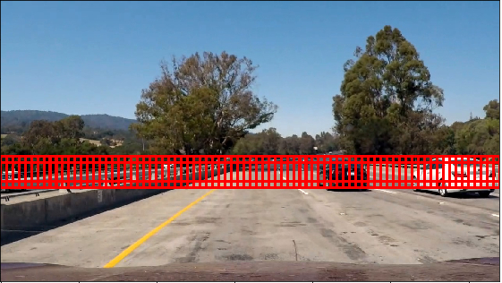</td>
  </tr>
  <tr>
    <td>1.5 (96x96 pixels)</td>
    <td>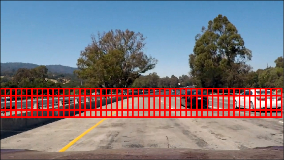</td>
  </tr>
  <tr>
    <td>2 (128x128 pixels)</td>
    <td></td>
  </tr>
  <tr>
    <td>3 (192x192 pixels)</td>
    <td>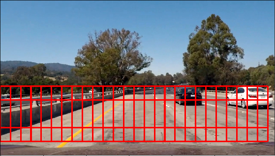</td>
  </tr>
</table>

The function _find_cars()_ extracts the features corresponding to each window, normalize those features using the previously described _StandardScaler()_ object, reduces the dimensionality of the feature vector using _PCA_ and finally, it employs the described classifier in order to determine whether there is a vehicle in the window or not.

#### 2.2 Car detections

The function _find_cars()_ returns a list of windows or bounding boxes where the classifier believes a vehicle may be present. We can then draw all these windows in the original image as shown below using the function _draw_boxes()_ located in lines 153-164 of the [utils](./utils/utils.py) file.

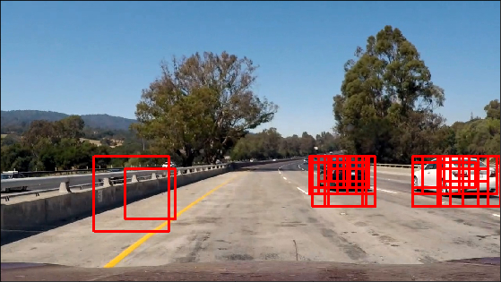

#### 2.3 Multiple Detections & False Positives

It is clear that the classifier is not perfect and that it may miss-classify some of the generated windows. As it can be seen at the left of the image above, changes in illumination, scale or position within the searching window may produce a wrong classification output. It is also possible, as shown at the right of the previous image, that a car gets detected simultaneously by several windows (multiple detections), thus resulting in several windows overlapping each other without a clear idea of where exactly the car is located.

In order to combine overlapping detections and remove false positives we will build a _heat-map_ like the one presented below. This heat-map is generated by adding _heat (+=1)_ for all pixels within the windows returned by the _find_cars()_ function. This process is performed by the function _add_heat()_ located in lines 314-322 of the [utils](./utils/utils.py) file.

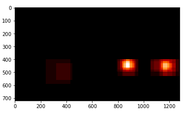

Once a heat-map like the one above has been generated, we can remove false positives by rejecting areas of the heat-map which value is below a given threshold. To do this, I implemented the function _apply_threshold()_ located in lines 324-328 of the [utils](./utils/utils.py) file. The specific threshold needs to be fine-tuned.

Finally, once we have a thresholded heat-map, we can use the _label()_ function from _scipy.ndimage.measurements_ to determine how many cars we have in the current frame. After obtaining these labels, we can call the function _draw_labeled_bboxes()_ (lines 330-345 of the [utils](./utils/utils.py) file) to draw the final bounding boxes around the detected vehicles as shown below.

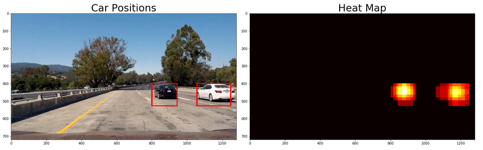

I have tested the proposed pipeline in the different testing frames located in the _test_images_ [folder](./test_images). Some of the results are shown below.

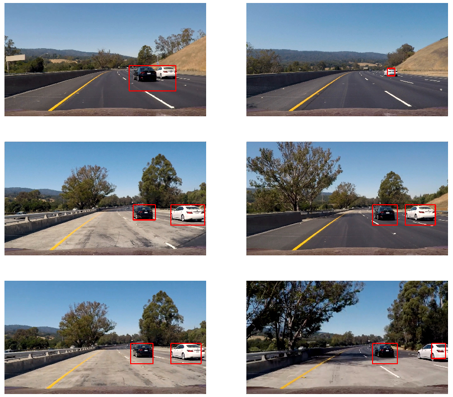

#### 2.4 Generating videos

I created [this](./Generate_video.ipynb) notebook to load the different testing videos and to generate the final results using _moviepy_. The notebook loads all the different components (classifier, scaler, PCA) in the second cell and defines a _process_frame(image)_ function in cell 5. Moviepy will take care of calling this function frame by frame after loading the videos in cells 6 and 7. Once all the frames have been processed a video output is saved in [output_videos](./output_videos).

This final notebook also defines a _Detections()_ class which will work as a queue for storing all the detection windows collected during the last _K_ frames. The idea is that by collecting the heat-maps from many frames, we can define a threshold which looks for areas in the image that have collected a lot of _heat_ during the last frames and are therefore more likely to contain a vehicle. This procedure helps us to decrease the number of false positives detected by our classifier.

Executing the final pipeline in the project video can take some time given the number of searching windows we have defined; for this reason, in this stage I have also define a region of interest in the X-axis which considers mainly the right side of the images.

The generated videos can be found in the [output_videos](./output_videos) folder. The animation at the top of this README also presents the final results on the project video.

## Discussion

One of the main problems of the proposed pipeline, in my opinion, is the time it requires to process each individual frame. Although the classifier's inference time is quite short, the required processing time per frame scales rapidly with the number of searching windows. Moreover, the accuracy of the detection pipeline is proportional to the number of windows, thus making it impossible to just reduce this number without proper consideration.

Another shortcoming of the current approach can be observed when dealing with overlapping detections as shown in the image below. The use of a heat-map does nor allow us to distinguish between two different detections when the windows representing each of them overlap.

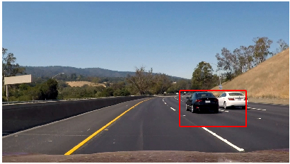

It is clear that better and more robust results can be obtained nowadays by using deep learning architectures. A very nice and complete example of this can be found [here](http://publications.lib.chalmers.se/records/fulltext/238495/238495.pdf). Deep convolutional networks do not require us to define a set of features and many of the state of the art architectures can even operate on real time (more than 30 frames per second).

Nevertheless, the current approach could still be improved a little bit. We could improve our classifier performance either by choosing a different technique, or by collecting more data. Moreover, we could deal with the problem of overlapping detections by storing a template of the current detections. A specific class could then be used to track and update each particular template as they enter or leave the scene. Because we will be tracking templates continuously, there should not be a significant change from frame to frame. 
