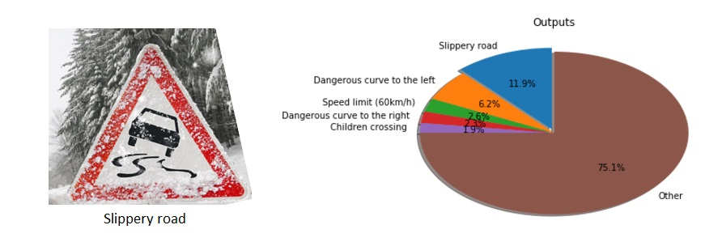

# Self-Driving-Car-Nanodegree
Projects for the UDACITY Self-Driving Car Nanodegree

<table>
  <tr>
    <td align="center">Project Name</td>
  </tr>
  <tr>
    <td align="center"><a href="./P1-Finding-Lanes">P1: Finding Lane Lines on the Road</a></td>
    <td align="center"></td>
  </tr>
  <tr>
    <td align="center"><a href="./P2-Traffic-Sign-Recognition">P2: Build a Traffic Sign Recognition Program</a></td>
    <td align="center"></td>
  </tr>
  <tr>
    <td align="center"><a href="./P3-Behavioral-Cloning">P3: Behavioral Cloning Project</a></td>
    <td align="center"></td>
  </tr>
  <tr>
    <td align="center"><a href="./P4-Advanced-Lane-Finding">P4: Advanced Lane Finding</a></td>
    <td align="center"></td>
  </tr>
  <tr>
    <td align="center"><a href="./P5-Vehicle-Detection">P5: Vehicle Detection and Tracking</a></td>
    <td align="center"></td>
  </tr>
</table>
